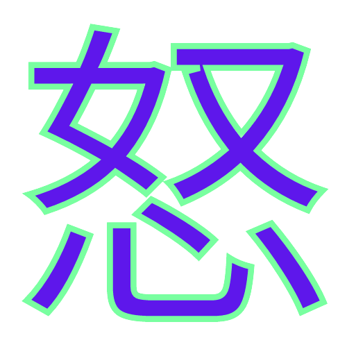

# Portafolio 💼

## Construido con :hammer_and_wrench:

* JavaScript 🧠
* CSS 🎩
* HTML 💀

## Color Reference 🎨

| Color          | Hex                                                                |
| -------------- | ------------------------------------------------------------------ |
| Neon Green     |  `#09fa01` |
| Electric purple|  `#6d01fa` |
| Burnt Orange   |  `#fd9329` |
| Pastel Purple  |  `#7a72d8` |
| Black          |  `#000000` |
| White          |  `#ffffff` |

## Autor :fountain_pen:

  
   
  <i>Designed & Built by Brandon Avendaño Villegas</i>
   
  <b>Crafted with ❤</b>

